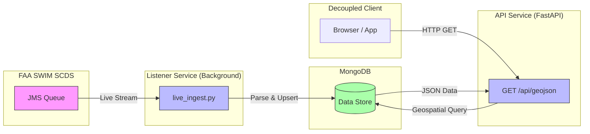

# Map NOTAM API v1 - Production Microservice

## Project Description
This project is a production-ready **NOTAM Ingestion & Visualization Microservice**. It connects to the FAA SWIM Cloud Distribution Service (SCDS), ingests live NOTAM (Notice to Air Missions) data, parses complex fields (Dates, Q-Codes, Geometries), and serves them via a high-performance **FastAPI GeoJSON Endpoint**.

Designed for integration into larger platforms, it operates as a "headless" backend service with a decoupled frontend for testing.

## Current Status
- **Architecture**: Microservice-based (API, Listener, DB)
- **Deployment**: ✅ Fully Dockerized (Production Ready)
- **Data Source**: Real-time FAA SWIM (AIXM 5.1)
- **Visualization**: Mapbox GL JS (Decoupled Testing)
- **Parsing**: Advanced extraction of Q-Codes, Schedules, and Validity Times.

## Architecture Flow



## Prerequisites

- Python 3.9+ (For local dev)
- **Docker & Docker Compose v2+** (For Production)
- FAA SWIM SCDS Credentials

## Setup & Usage

### 1. Configuration
Create a `.env` file in the root directory with your credentials:
```bash
SWIM_HOST=...
SWIM_VPN=...
SWIM_QUEUE=...
SWIM_USERNAME=...
SWIM_PASSWORD=...
MapboxAccessToken=...  # Required for Frontend Visualization only
ENV=PROD               # Set to DEV to enable static file serving from API
```

### 2. Start Production Stack
Launch the full backend (Database + API + Live Listener):
```bash
docker-compose up -d
```
*   **map-notam-api**: Runs the FastAPI backend on port `8000`.
*   **map-notam-listener**: Connects to FAA SWIM and ingests data in real-time.
*   **map-notam-mongo**: Stores data with geospatial indexing.

### 3. Data Management (Maintenance)
You can manage the database state using the provided utility containers.

**A. Clear Database**
To completely wipe all current data:
```bash
docker-compose run --rm clear-db
```
*   *Warning: This action is irreversible.*

**B. Fetch Snapshot (Initial Seed)**
To fetch new messages from the queue and populate the DB:
```bash
docker-compose run --rm snapshot
```
*   Fetches messages to `./data/raw_notam_dump.xml` (persisted on host).
*   Parses and loads them into MongoDB.

**C. Reparse Existing Data**
To re-process data that has already been downloaded (without connecting to the queue):
```bash
docker-compose run --rm reparse
```
*   Reads from `./data/raw_notam_dump.xml`.
*   Useful if you have updated parsing logic (e.g., regex fixes) and want to apply it to existing raw files.

**Important**: After running these maintenance tasks, ensure your main API service is running:
```bash
docker-compose up -d
```

### 4. API Usage
The service exposes a standard GeoJSON endpoint suitable for any map client (Mapbox, Leaflet, OpenLayers).

**Endpoint**: `GET http://localhost:8000/api/geojson`

**Parameters**:
| Param | Type | Description |
| :--- | :--- | :--- |
| `lat` | float | Latitude of center point |
| `lon` | float | Longitude of center point |
| `radius` | int | Radius in Nautical Miles (Default: 10) |
| `category` | string | Optional filter (e.g., 'Aerodrome', 'Airspace') |

**Example**:
```bash
curl "http://localhost:8000/api/geojson?lat=42.36&lon=-71.06&radius=20"
```

### 5. Frontend Visualization (Testing)
Since the production API is "headless", use the decoupled HTML file for visualization:

1.  Locate `app/static/map.html`.
2.  Open it directly in your browser (file:// protocol is fine).
3.  It is pre-configured to connect to `http://localhost:8000`.
4.  Enter your Mapbox Token if prompted (or hardcode it in the file for dev).

## Data Dictionary (Parsed Fields)
The ingestion engine extracts the following from raw NOTAM text:
- **Validity Dates**: Start/End times extracted from `B)` and `C)` fields.
- **Q-Code**: Parsed `Q)` line for Category and Purpose.
- **Geometry**: Polygons, Circles, or Points derived from coordinates.
- **Schedule**: Active hours (if available).
