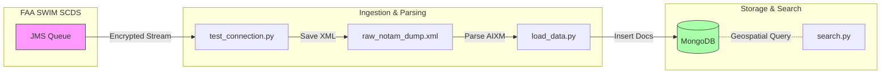

# Map NOTAM API v1 - Phase 2: Parsing & Storage

## Project Description
This project has evolved from a simple connectivity POC (Phase 1) to a functional parsing and storage system (Phase 2). It validates the connection to the FAA SWIM Cloud Distribution Service (SCDS), parses the raw AIXM 5.1 XML messages, stores them in a MongoDB database with geospatial indexing, and allows for proximity-based searching.

## Current Status
- **Connectivity**: ✅ Verified (Solace JMS over TCP/TLS)
- **Data Format**: Parsed from AIXM 5.1 XML
- **Storage**: ✅ MongoDB (Dockerized) with 2dsphere indexing
- **Search**: ✅ Geospatial query support (Find NOTAMs by radius)

## Architecture Flow



## Prerequisites

- Python 3.9+
- Docker & Docker Compose (for MongoDB)
- FAA SWIM SCDS Credentials

### Dependencies
- `solace-pubsubplus`: Messaging API
- `pymongo`: MongoDB Driver
- `defusedxml`: Secure XML parsing

## Setup & Usage

1. **Install Dependencies**
   ```bash
   pip install -r requirements.txt
   ```

2. **Configure Credentials**
   Ensure your `.env` file contains your SWIM credentials (see `test_connection.py` for details).

3. **Start Database**
   Start the MongoDB instance using Docker:
   ```bash
   docker-compose up -d
   ```

4. **Fetch & Load Data**
   First, capture some data (if you haven't already):
   ```bash
   python test_connection.py
   ```
   Then parse and load the data into MongoDB:
   ```bash
   python load_data.py
   ```

5. **Search NOTAMs**
   Search for NOTAMs within a specific radius (default 10 NM) of a coordinate:
   ```bash
   # Search near Logan Airport (KBOS)
   python search.py 42.3656 -71.0096 --radius 20
   ```
